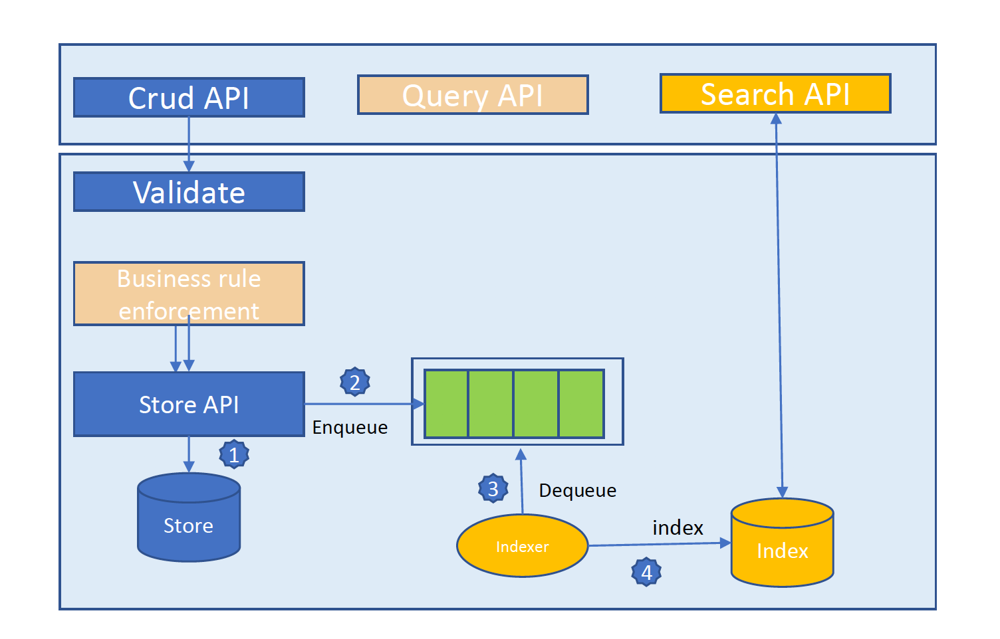

## Advanced Big Data Applications and Indexing Techniques

### Final System Architecture Diagram

### Northeastern University - 2020

repo of INFO-7255 course project

### Prerequisite

For this course, I developed the backend REST API, by utilizing

- **Spring Boot**
- **Redis**
- **Json Schema Validator**
- **Google Oauth 2.0**

### Features

1. ##### Demo 1

   - Develop a Spring Boot Web service and implement ***GET***, ***POST***, ***DELET*** method
   - Configure the noSQL, validate the post json schema and save content in Redis

2. ##### Demo 2

   - Create the token service to authorize the REST API operation, by utilizing ***Google Oauth 2.0*** as the token server
   - Add the ***PUT*** and ***PATCH*** to implement the resource update and json-patch update

